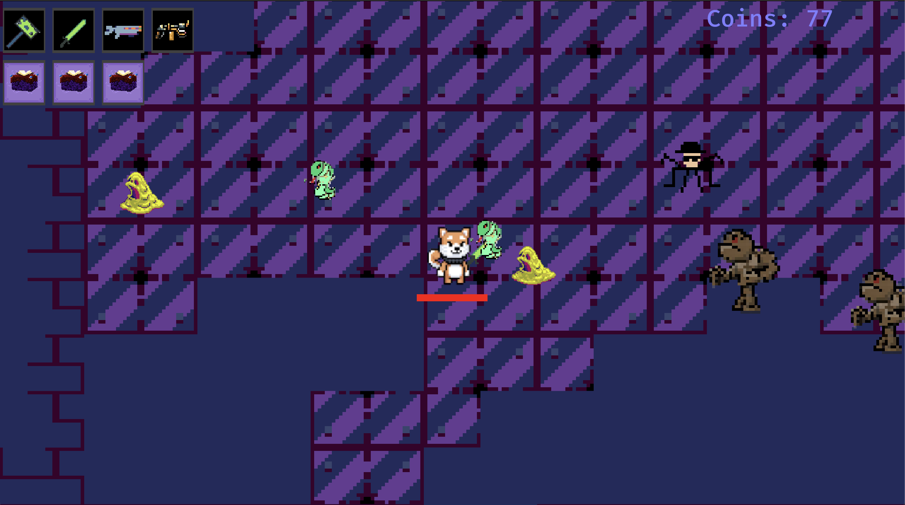

## Speedrun Survivors

A game for true crypto degens. Play as Bonk Inu, Pepe or a Mad Lad and punish hordes of enemies with your mighty arsenal of bone crushing weapons. 
Speedrun Survivors is an area game with waves of enemies charging the player and the goal is to kill as many of them as fast as possible. 
The game rewards the player with gold for excellence. 
Gold obtained can be traded for heroes, weapons and buffs of all kinds.

### Inspiration
- Vampire Survivors
- Worms

### Player Character
- Pepe
- Bonk Inu
- Pudgy Penguin
- Crypto Kitties
- Mad Lads
- will add different NFT hero characters over time
  - each with different base stats
  - theoretical collaboration with any existing NFT collection

### Character stats
- Health
- Health regen
- Movement speed
- weapon cooldown +/- x %

### Weapons
- possible Manual Aim (Primary; ACTIVE)
    - CONSIDER THIS: manual aim -> complex REPLAY check
        - fire on click -> with rotation in 256 increments (u8)
        - this whole game is about attack spamming
            - not realistic to constantly update rotation
        -  manual aim main attack must be slow (cooldown) and insanely powerful (fun) if added
    - BEAM rifle
    - RPG
- Passive Attacks
    - Grenade launcher
        - Napalm AoE
        - Explosive AoE
    - Nova attacks
        - Electric shock
        - Fire
    - Flame Thrower
    - Drones
        - Man-Hack (Half Life 2)
        - Shooting
    - Laser beams

### Passive Buffs / DeBuffs
- Invincibility on DMG received
- More XP gained
- More Gold gained
- AoE boost
- DMG boost
- Cooldown boost
- Health boost
- Health regen boost
- Movement speed boost
- Magnet for gold / item Pickup
- Debuffs allow players to get higher scores if they survive it
  - faster enemy spawn
  - greater quantity of enemies spawned

### Undead system
- hero gains
  - 100% attack speed
  - 100% move speed
- start a timer of 10 - 30 sec
- will explode in huge blast if time runs out
- has to either
    - find a shrine of resurrection in due time
    - defeat some Death boss enemy and drain/possess their soul or whatever for a resurrection
    - this could possibly influence the look of their NFT
        - becomes more death-ish (ghoul like) looking over time? (how to do that; need upgradeable NFTs)

### Tech thoughts

#### Replays
- generate some u256 random number to derive (seed) all "randomness" from
- this is the replay GUID
- to prevent replay attacks, each GUID should be globally unique forever
- all user input is logged.
- Server replays should arrive at the same outcome
    - award NFTs and Tokens
    - requires single threaded RNG access I suppose
- Protocol thoughts
    - 1 byte action OP code
    - 3 byte tick (= 60 tickrate)
        - 3 bytes allow for 4660 minutes = 77 hours
    - = 4 byte per WASD action (@5APS -> 9000 actions -> 36000 byte -> ~35 KB)
    - Could compress by using several OPCODEs
        - W_ON_2 +2 byte
        - W_ON_3 +3 byte
        - A_ON_2 +2 byte
        - A_ON_3 +3 byte
        - ... S, D (_ON_ and _OFF_)(=16 OpCodes)
        - FIRE +1 byte (rotation 256 degrees then -> 1.4° increments)

### Bugs
- LDTK
  - maps does not appear in wasm+chrome

### TODO
- XP system
  - could be similar to coin_reward (or even use that)
  - should we have enemy drop XP crystals as in Vamp Survivor?
- Level up system
- Gameplay Effect System
  - need some gameplay data
  - items should have Gameplay Effect stacks
  - need to gather this data and attach it to the player
- UI
  - TIME ELAPSED
  - LEVEL PROGRESS
- REPLAY / recording system
    - playback system
    - headless server playback
- VFX
    - https://bevyengine.org/examples/2D%20Rendering/bloom-2d/

### NFTs
What would be a resale value? What would make them tradeable?

- Cool looks
- heros are NFTs with various base stats
    - i.e. Pepe is fast but weak, ...
    - must not be required to play (can always play mint NFT after then game to "save state")
        - always a free mint of base hero
- NFTs as powerups; equipped inventory style at the start of a game
- NFTs as weapons; equipped inventory style at the start of a game

How to not flood the market and make them worthless?

- Derived & bind to ladder mode / season / cohort
- lost on death?
- maybe some "craft" logic that lets users combine / upgrade their NFTs but there is some chance it fails and all NFTs get deleted?
    - Lineage enchanting style

### Token
Launch without a token but keep track of player scores (in-game gold) - do an airdrop to players and or twitter followers or galxe quest etc.

This token could then be used to:
- buy NFTs, upgrades etc.
- unlock new maps, game modes, ...
- join ranked ladders ("pro play")